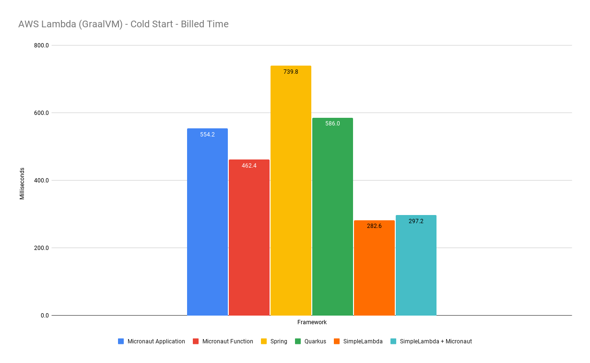
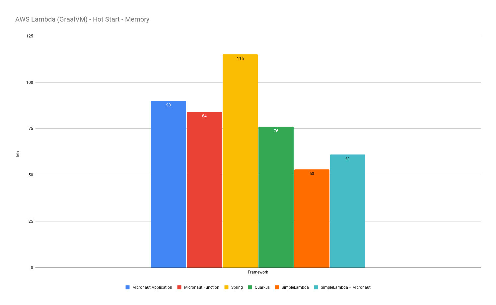
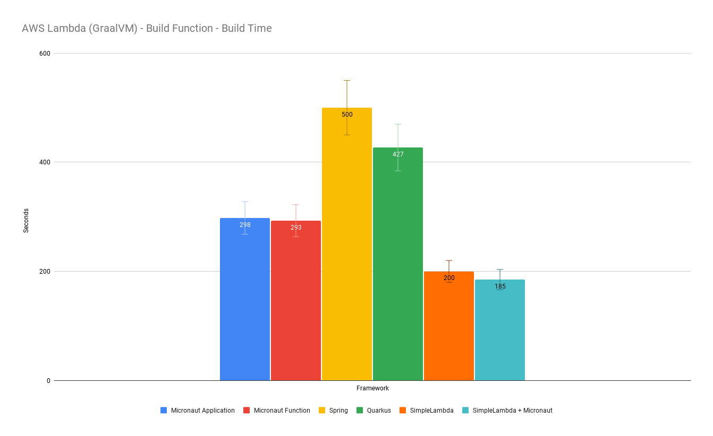
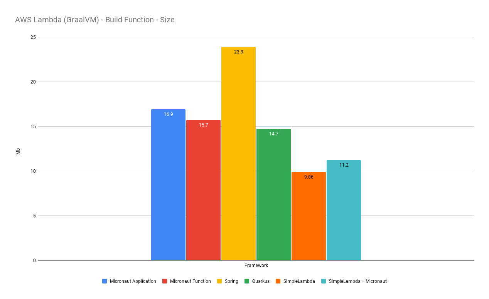

# AWSLambda Java Examples

Repository with AWSLambda examples for different frameworks Java Frameworks compiled
for [GraalVM](https://www.oracle.com/cis/java/graalvm/what-is-graalvm/) such:

- [Micronaut](https://docs.micronaut.io/latest/guide/)
- [Spring](https://docs.spring.io/spring-framework/reference/index.html)
- [Quarkus](https://quarkus.io/guides/)
- [SimpleLambda](https://github.com/GoodforGod/simple-awslambda)

## Benchmark

Benchmark tries to compare different Java frameworks that can be used to
build [AWS Lambda Function](https://docs.aws.amazon.com/lambda/latest/dg/welcome.html).
Benchmark compares cold start time, hot start time, building process, etc.

### GraalVM Versions

All examples use `GraalVM 22.3.0` cause at that time Spring & Quarkus latest available GraalVM build image
was `GraalVM 22.3.0`.
Those frameworks are limited by their plugins/buildpacks/etc, so you **can't** use latest available GraalVM native image
released, all depends on framework toolkit which upgrades with lag.

Thus, Micronaut & SimpleLambda have advantage as GraalVM building process & Jar building process can be *easily*
independent.

### Framework Versions

| Spring Boot | Spring Cloud | Micronaut | Quarkus | SimpleLambda | 
|-------------|--------------|-----------|---------|--------------|
| 3.1.3       | 4.0.5        | 4.0.3     | 3.3.0   | 1.0.0        |

### Cold Start

Test data is collected based on 5 runs and average for each value is present in table below:

| Framework     | Spring | Quarkus | Micronaut (Application) | Micronaut (Function) | SimpleLambda + Micronaut | SimpleLambda |
|---------------|--------|---------|-------------------------|----------------------|--------------------------|--------------|
| Build (ms)    | 527.4  | 349.0   | 442.8                   | 398.8                | 278.5                    | 237.1        |
| Duration (ms) | 212.1  | 236.5   | 110.9                   | 63.2                 | 18.3                     | 31.8         |
| Billed (ms)   | 739.8  | 586.0   | 554.2                   | 462.4                | 297.2                    | 282.6        |
| Memory (Mb)   | 115    | 76      | 89                      | 83                   | 60                       | 52           |

### Hot Start

Test data is collected based on 5 runs and average for each value is present in table below:

| Framework     | Spring | Quarkus | Micronaut (Application) | Micronaut (Function) | SimpleLambda + Micronaut | SimpleLambda |
|---------------|--------|---------|-------------------------|----------------------|--------------------------|--------------|
| Duration (ms) | 2.9    | 1.2     | 1.9                     | 1.8                  | 1.4                      | 1.4          |
| Billed (ms)   | 3.2    | 2.0     | 2.2                     | 2.0                  | 2.0                      | 2.0          |
| Memory (Mb)   | 115    | 76      | 90                      | 84                   | 61                       | 53           |

Hot start billed time is same across all competitors cause when function is instantiated it performs relatively fast.

### Build Time

Data is based on build benchmark
in [GitHub CI action](https://github.com/GoodforGod/awslambda-java-examples/actions/runs/6077660352):

| Framework        | Spring | Quarkus | Micronaut (Application) | Micronaut (Function) | SimpleLambda + Micronaut | SimpleLambda |
|------------------|--------|---------|-------------------------|----------------------|--------------------------|--------------|
| Build Time (sec) | 500    | 427     | 298                     | 293                  | 185                      | 200          |

### Build Size

Result function `zip` archive size in Mb:

| Framework | Spring | Quarkus | Micronaut (Application) | Micronaut (Function) | SimpleLambda + Micronaut | SimpleLambda |
|-----------|--------|---------|-------------------------|----------------------|--------------------------|--------------|
| Size (Mb) | 23.9   | 14.7    | 16.9                    | 15.7                 | 11.2                     | 9.86         |

### Functionality

Table with some useful and interesting functionality that some frameworks provides, so it won't look that some
frameworks are bad and others are great.

| Framework           | Spring                                                                                                     | Quarkus                                                                                                    | Micronaut (Application)                                                                                                                                                    | Micronaut (Function)                                                                                                                                                       | SimpleLambda + Micronaut                                                                                                                                        | SimpleLambda                                                                                                                                                    |
|---------------------|------------------------------------------------------------------------------------------------------------|------------------------------------------------------------------------------------------------------------|----------------------------------------------------------------------------------------------------------------------------------------------------------------------------|----------------------------------------------------------------------------------------------------------------------------------------------------------------------------|-----------------------------------------------------------------------------------------------------------------------------------------------------------------|-----------------------------------------------------------------------------------------------------------------------------------------------------------------|
| DI & IoC            | ✔️                                                                                                         | ✔️                                                                                                         | ✔️                                                                                                                                                                         | ❌                                                                                                                                                                          | ✔️                                                                                                                                                              | ❌                                                                                                                                                               |
| AWS Gateway Support | ✔️                                                                                                         | ✔️                                                                                                         | ✔️                                                                                                                                                                         | ✔️                                                                                                                                                                         | ✔️                                                                                                                                                              | ✔️                                                                                                                                                              |
| AWS Gateway Routing | ❌                                                                                                          | ❌                                                                                                          | ✔️                                                                                                                                                                         | ❌                                                                                                                                                                          | ❌                                                                                                                                                               | ❌                                                                                                                                                               |
| AWS Integrations    | [✔️](https://spring.io/projects/spring-cloud-aws)                                                          | [✔️](https://docs.quarkiverse.io/quarkus-amazon-services/dev/index.html)                                   | [✔️](https://micronaut-projects.github.io/micronaut-aws/latest/guide/)                                                                                                     | [✔️](https://micronaut-projects.github.io/micronaut-aws/latest/guide/)                                                                                                     | [✔️](https://micronaut-projects.github.io/micronaut-aws/latest/guide/)                                                                                          | ❌                                                                                                                                                               |
| GraalVM Metadata    | [Auto](https://www.graalvm.org/latest/reference-manual/native-image/metadata/AutomaticMetadataCollection/) | [Auto](https://www.graalvm.org/latest/reference-manual/native-image/metadata/AutomaticMetadataCollection/) | [Auto](https://www.graalvm.org/latest/reference-manual/native-image/metadata/AutomaticMetadataCollection/)/[Manual](https://docs.micronaut.io/latest/guide/#graalServices) | [Auto](https://www.graalvm.org/latest/reference-manual/native-image/metadata/AutomaticMetadataCollection/)/[Manual](https://docs.micronaut.io/latest/guide/#graalServices) | [Auto](https://www.graalvm.org/latest/reference-manual/native-image/metadata/AutomaticMetadataCollection/)/[Manual](https://github.com/GoodforGod/graalvm-hint) | [Auto](https://www.graalvm.org/latest/reference-manual/native-image/metadata/AutomaticMetadataCollection/)/[Manual](https://github.com/GoodforGod/graalvm-hint) |
